import { Aside } from '@astrojs/starlight/components';
import { Icon } from '@astrojs/starlight/components';
import YouTube from '../../../components/YouTube.astro';

## Learning Objectives

By the end of this week, students will be able to:

1. **Understand Vector Graphics:** Learn the advantages of vector graphics, including scalability and versatility, and how they differ from raster graphics.
2. **Navigate Adobe Illustrator:** Become proficient with Illustrator's interface, customizing the workspace, and managing tools for an efficient workflow.
3. **Master Layers and Artboards:** Organize and manage layers effectively for complex graphic compositions, and use artboards for multi-layout designs.
4. **Create and Edit Shapes and Paths:** Build and modify basic and complex shapes using Illustrator's shape tools and path creation techniques.
5. **Precision Drawing with the Pen Tool:** Gain expertise in using the Pen Tool for precision drawing and editing, including manipulating Bezier curves.
6. **Apply Transformations and Pathfinder Tools:** Use transform options and Pathfinder tools to create dynamic designs by combining and modifying shapes.
7. **Work with Color and Export:** Understand how to apply color to fills and strokes, and learn how to export designs for various screen formats.

## Demo Files

[demo-Pen-tool](https://drive.google.com/file/d/1WyE6E3UiAxKop_kY-YX1jTQdMw8Yx8qa/view?usp=sharing)

[demo-drawing-with-shapes](https://drive.google.com/file/d/1x3grcghX78odQJoGhX4uXiUD4Bo8HHyu/view?usp=sharing)

## 1. What is Adobe Illustrator?

Adobe Illustrator is a powerful vector graphics editor used by designers and artists to create a wide range of visuals, including logos, illustrations, typography, and complex graphics. Unlike raster graphics, vector graphics are made up of paths, making them infinitely scalable without loss of quality.

### 1.1 Understanding Vector Graphics and Their Advantages

Vector graphics consist of paths defined by points, curves, and angles. Key advantages of vector graphics include:

- **Scalability:** They can be resized without losing quality, making them perfect for everything from small icons to large billboards.
- **Smaller File Size:** Vector files are often smaller than raster images, making them easier to share and store.
- **Versatility:** Ideal for logos, typography, and intricate illustrations where precise, scalable graphics are needed.

**Watch:** [Vector vs Raster Graphics](https://youtu.be/p2thSkOa_Xg?si=4Gy2tQhPVCGCw-5R)

## 2. Illustrator's Interface and Workspace

Illustrator's interface is a comprehensive workspace designed for vector graphic creation. Understanding this interface is crucial for efficient workflow.

**Key Aspects of Illustrator's Workspace**

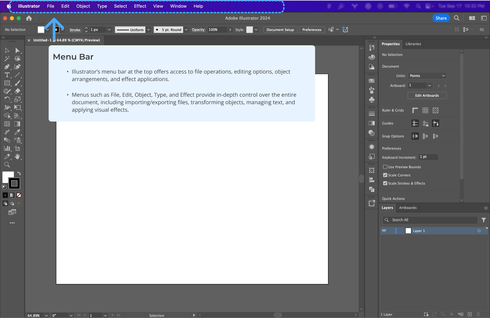
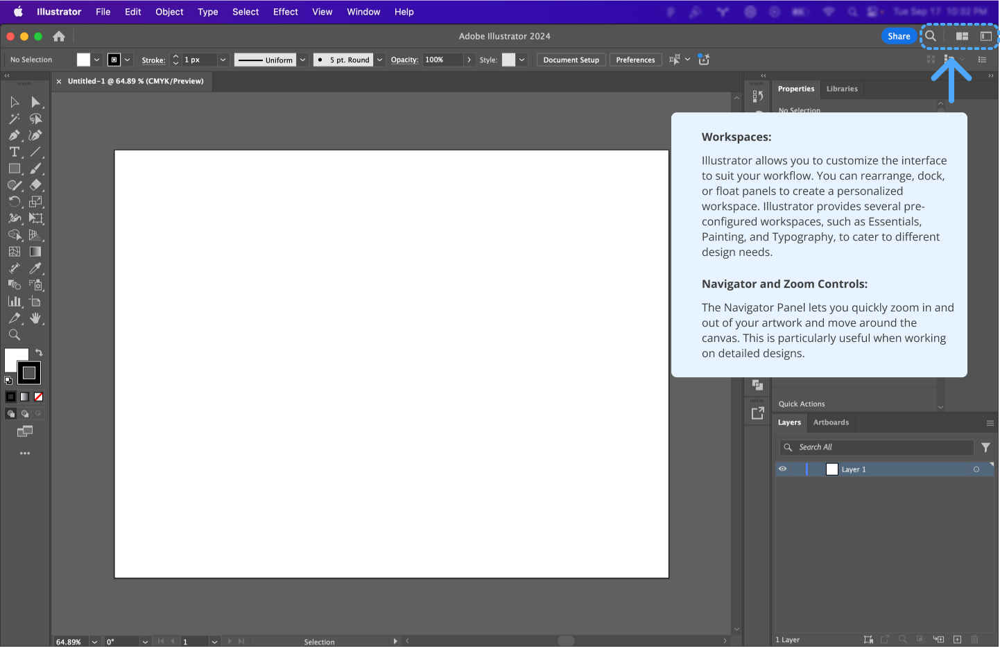
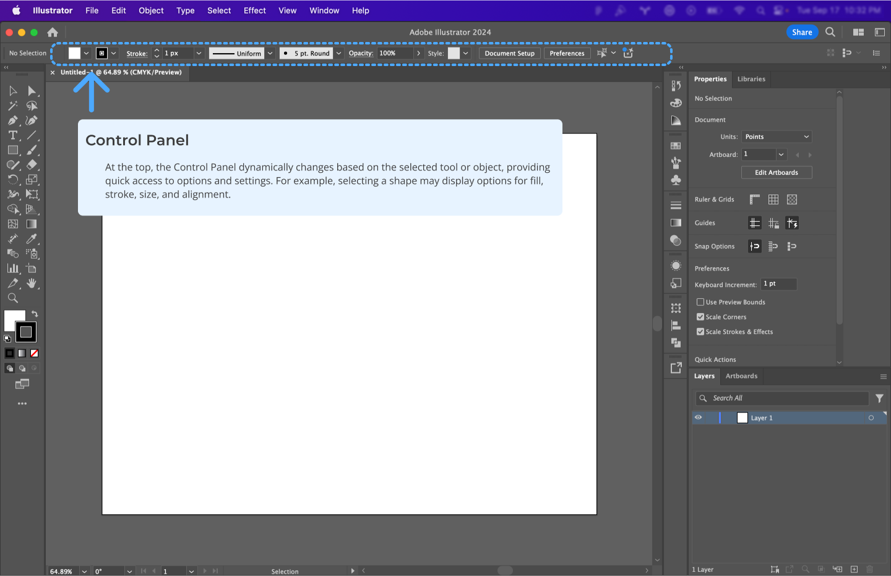
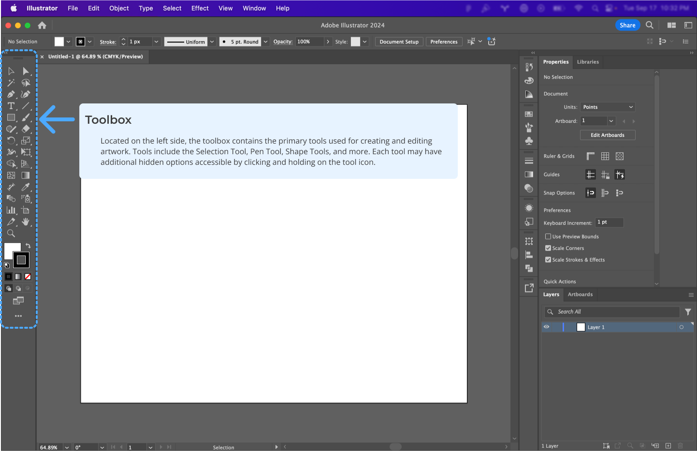
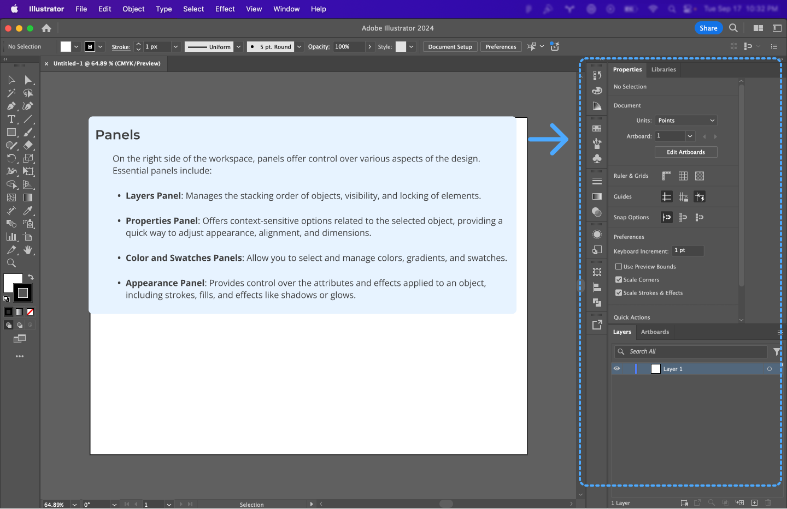
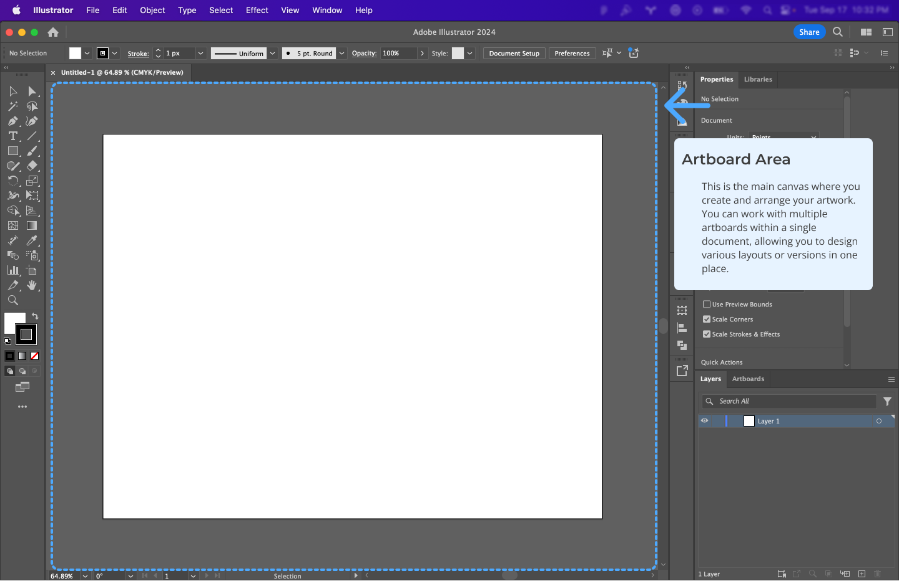

**Watch:** [Get to Know Illustrator (4 videos)](https://helpx.adobe.com/ca/illustrator/how-to/ai-basics-fundamentals.html)

 

## 3. Artboards and Layer Management

### 3.1 Artboards

Artboards are like individual canvases within a single document. Use them to create multi-page documents, different versions of a design, or separate elements that make up a larger graphic.

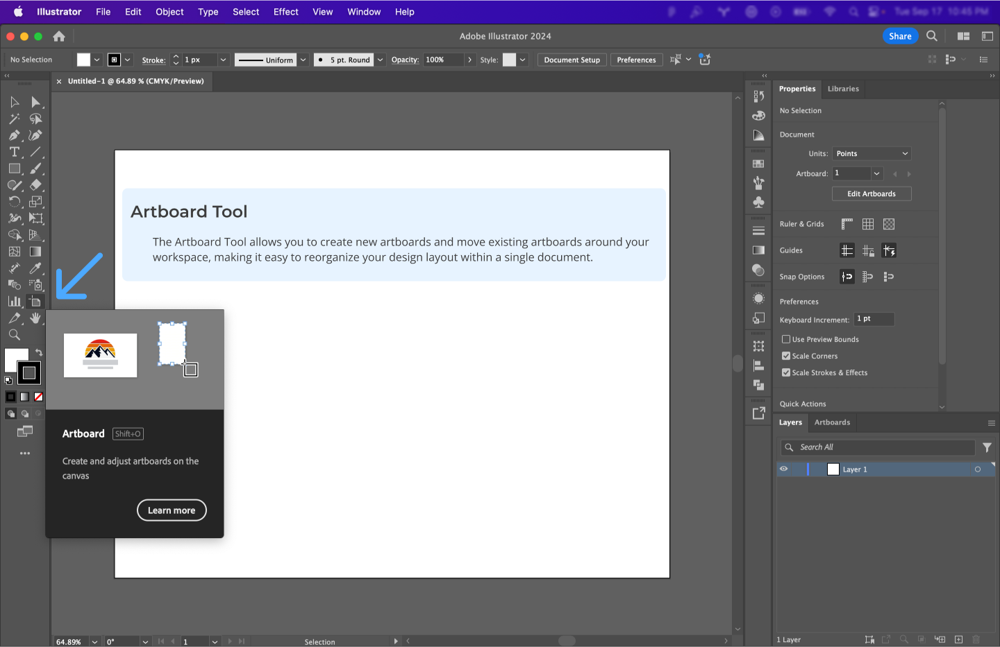
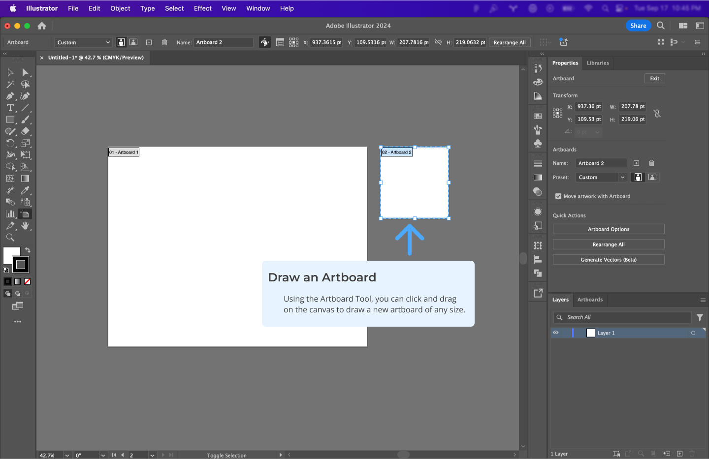
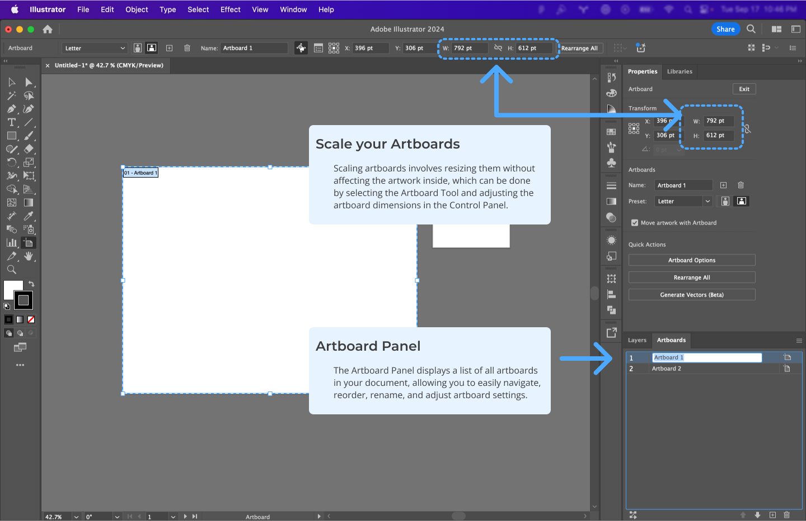

**Watch:** [Artboard Tutorial (3 videos)](https://helpx.adobe.com/ca/illustrator/how-to/artboards-basics.html)

### 3.2 Layer Management

Layers in Illustrator allow you to stack, organize, and isolate elements in your design, making it easier to manage complex compositions. They let you work on individual components without affecting others, enhancing both creativity and precision in your workflow.

- **Creating and Managing Layers:** Add new layers to separate different elements of your design, such as background, text, and graphics. This organization makes it easier to edit specific parts without disturbing the rest of the composition.
- **Grouping and Selecting:** Group multiple objects into a single unit using the **Group** function. This allows you to move, scale, or apply changes to multiple elements simultaneously. Use the **Selection Tool** to quickly select entire groups or individual elements within a layer.
- **Locking and Hiding Layers:** Lock layers to prevent accidental modifications to elements you don't want to change. You can also hide layers temporarily to focus on specific parts of your design without distractions.
- **Using Sub-layers:** Sub-layers provide further organization within a primary layer, letting you manage complex designs more effectively by breaking them down into manageable parts.
- **Renaming and Color Coding:** Name your layers descriptively and assign colors to them in the Layers Panel. This practice makes it easier to identify and manage layers, especially when working with intricate designs.

> **Pro Tip:** Group related elements together and name your layers clearly to streamline your workflow, making your project easier to navigate and edit.

## 4. Creating Basic Shapes and Paths

### 4.1 Shape Tools

Illustrator's shape tools allow for the creation of basic geometric forms like rectangles, circles, and polygons, which are the building blocks of more complex designs.

**Watch:** [Create and Edit Shapes (4 videos)](https://helpx.adobe.com/illustrator/how-to/shapes-basics.html)

### 4.2 Drawing Tools for Custom Shapes

Beyond basic geometric forms, Illustrator offers tools for creating custom shapes. This involves a deeper understanding of paths and how to manipulate them to achieve your desired design.

**Watch:** [Drawing Tools Tutorial (5 videos)](https://helpx.adobe.com/illustrator/how-to/drawing-tools-basics.html)

## 5. Transform Options: Rotate, Reflect, and Shear

Transforming objects is key to creating dynamic and varied designs. Learn to:

- **Rotate:** Change the angle of objects.
- **Reflect:** Mirror objects across a specified axis.
- **Shear:** Skew objects for perspective effects.

**Watch:** [Learn Transform Options](https://helpx.adobe.com/ca/illustrator/how-to/apply-rotation-and-reflection-in-artwork.html)

## 6. Pathfinder Tools: Combine and Manipulate Shapes

Pathfinder tools allow you to create complex shapes by combining and modifying simpler ones.

**Shape Modes:**

- **Unite:** Combines selected shapes into a single shape.
- **Minus Front:** Subtracts the front shape from the back shape.
- **Intersect:** Creates a shape from the overlapping area.
- **Exclude:** Removes the overlapping areas, leaving non-overlapping parts.

**Pathfinders:**

- **Divide:** Splits the shapes into individual components.
- **Trim:** Removes the top shape’s area from underlying shapes.
- **Merge:** Similar to Trim, but also merges adjacent shapes with the same fill.
- **Outline:** Converts shapes into compound paths with outlines.

**Watch:** [Level up your shape-building skills with Pathfinders](https://creativecloud.adobe.com/cc/learn/illustrator/web/combine-simple-shapes-to-make-complex-shapes?x-product=CCHome%2F1.0&x-product-location=Search%3ATutorials%3Alink%2F3.2.3&mv2=cch&locale=en)

## 7. Working with Color: Fill and Stroke

Apply color effectively to enhance your designs. Understand the difference between fill and stroke and how to use them:

- **Fill:** The interior color of an object.
- **Stroke:** The border or outline of an object.

**Watch:** [Learn About Color Basics](https://helpx.adobe.com/illustrator/how-to/color-basics.html)

> **Tip:** Use the Color Picker or Swatches panel to apply and modify colors quickly.

## 8. Exporting for Screens

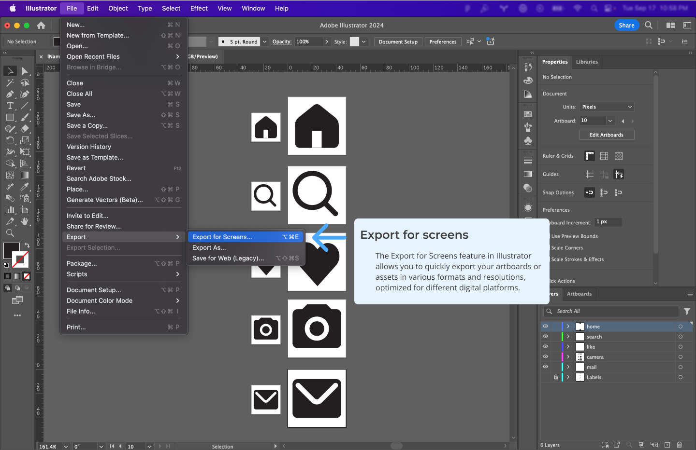
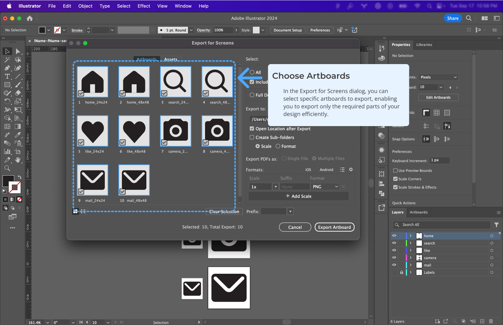
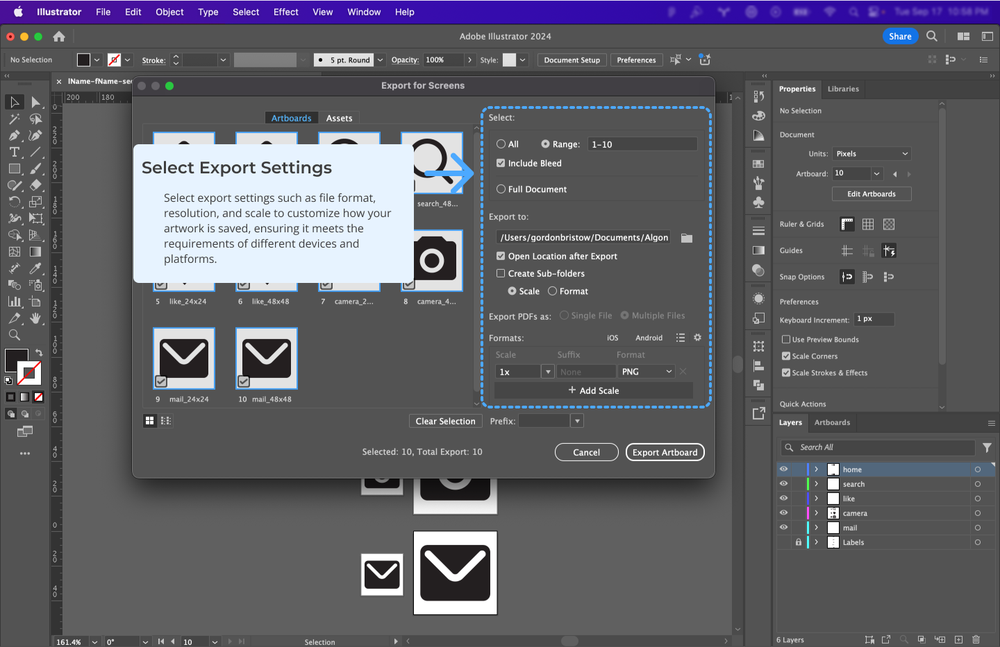
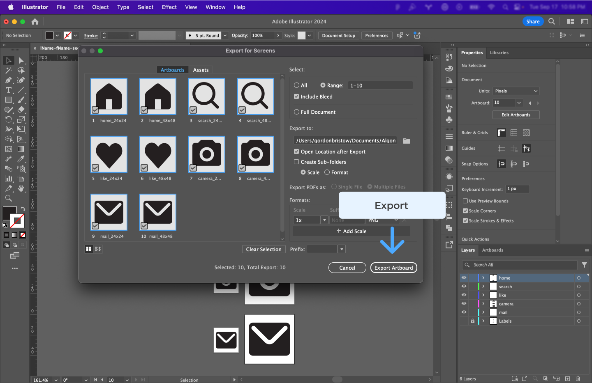

- **Artboards Preview:** See how your design will be exported.
- **Export Location:** Choose where to save your files.
- **Scale Options:** Export at multiple sizes for various screen resolutions.
- **Format Selection:** Choose between PNG, JPG, SVG, etc.
- **Creating Sub-folders:** Organize exports into sub-folders for better management.

> **Pro Tip:** Use Illustrator's **Export for Screens** to quickly save designs in multiple formats and resolutions.
