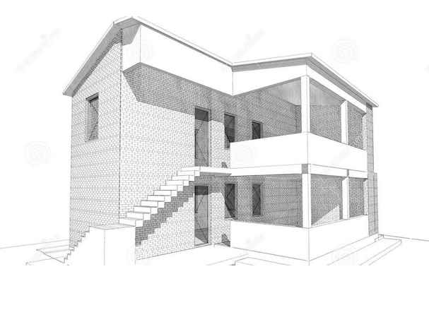
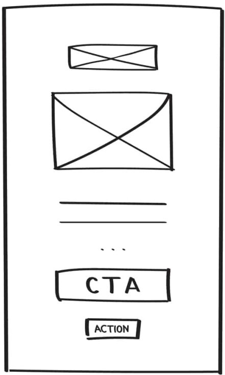
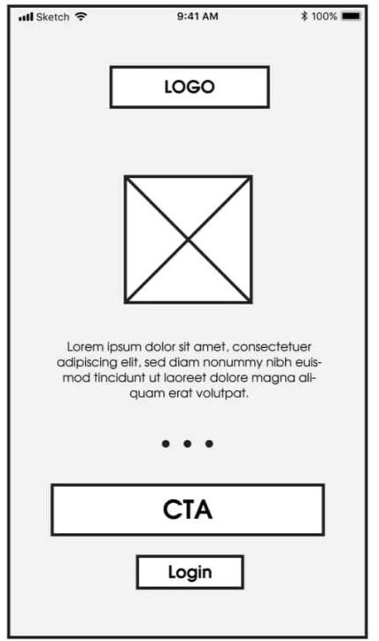
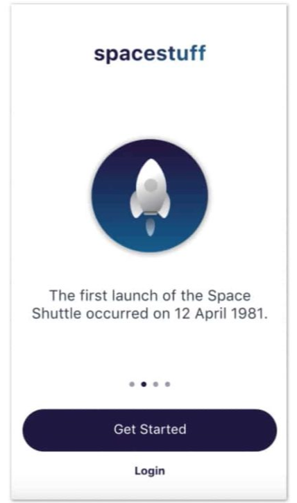
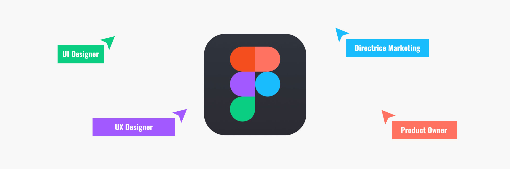
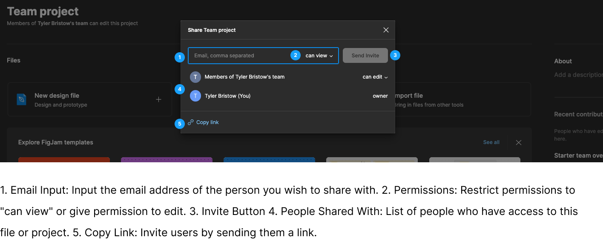
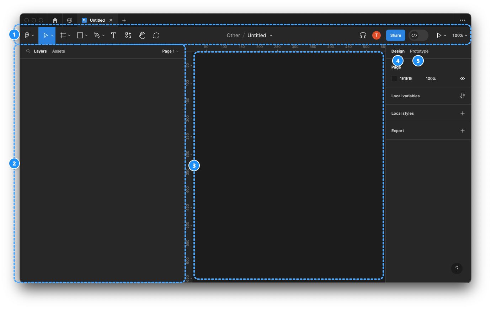

import { Aside } from '@astrojs/starlight/components';
import { Icon } from '@astrojs/starlight/components';
import YouTube from '../../../components/YouTube.astro';
import TwoColumnComponent from '../../../components/TwoColumnComponent.astro';

## Learning Objectives

By the end of this week, students will be able to:

1. **Understand the Importance and Purposes of Prototyping:** Explain the role of prototypes in the design process, including their use for user feedback, visualization, functionality testing, and validation.
2. **Identify Different Types of Wireframes:** Distinguish between low-fidelity, mid-fidelity, and high-fidelity wireframes, and understand their specific applications in the design process.
3. **Get Started with Figma:** Create a Figma account using a student email, understand the differences between the Starter and Education plans, and navigate the decision to use Figma's browser-based platform versus its desktop application.
4. **Navigate Figma's Interface and Utilize Basic Tools:** Familiarize with Figma's interface, including the toolbar, layers panel, canvas, design panel, and prototype panel. Gain practical experience with fundamental tools for moving, scaling, creating frames, and manipulating shapes.
5. **Engage in Real-Time Collaboration Using Figma:** Explore Figma's collaborative features, including real-time collaboration, comments and feedback, and the management of sharing and permissions at different levels (team, project, file, and page).
6. **Organize Projects and Control Access in Figma:** Understand and apply Figma's team-level sharing rules, project-level sharing rules, file-level sharing rules, and page-level sharing rules to manage design projects effectively.
7. **Introduction to Frames, Layers, and Groups in Figma:** Learn the basics of using frames for structuring designs, organizing elements with layers, and grouping elements for efficient manipulation and organization.

## Prototyping

Prototyping is a crucial step in the design process that involves creating interactive, testable representations of your design concepts. These prototypes can vary in fidelity, from low-fidelity wireframes to high-fidelity interactive simulations. Prototyping is essential for several reasons:

### Why Prototype

1. **User Feedback:** Prototypes allow you to gather early feedback from users or stakeholders. This feedback can help refine your design and identify potential issues.

2. **Visualization:** Prototypes provide a visual representation of your design ideas, making it easier for others to understand and evaluate the concept.

3. **Functionality Testing:** With interactive prototypes, you can test the functionality and user flow of your design, identifying any usability problems.

4. **Validation:** Prototypes help validate design decisions and ensure that the final product aligns with user needs and expectations.

### Wireframes

Wireframes are a type of prototype that focuses on the structural layout of a design.

### Types of Wireframes

#### Low-fidelity

Low-fidelity wireframing offers the advantage of rapid creation, making it an invaluable tool for brainstorming sessions. Its primary purpose is to facilitate the evaluation of the logical arrangement of content and functional elements on individual pages. In the pursuit of this objective, low-fidelity wireframes intentionally avoid the use of styling elements such as colors, images, and typography, ensuring that the wireframe's core purpose remains undistracted.

**Types of Low-fidelity Wireframes:**

- [Paper Sketches](https://www.uxpin.com/studio/blog/paper-prototyping-the-practical-beginners-guide/)
- [Grey-Box Wireframes](https://www.arcstone.com/blog/what-is-a-wireframe-and-why-is-it-all-grey-boxes)
- Reference Zone Wireframes

#### Mid-fidelity

Mid-fidelity wireframes are a balanced approach, offering a clearer depiction of content structure and layout compared to low-fidelity versions. While they include basic styling and might suggest interactions and user flow, they avoid intricate details. Mid-fidelity wireframes are efficient for collaboration, feedback collection, and usability testing, making them a popular choice in the design process.

**Types of Mid-fidelity Wireframes:**

- [Annotated Wireframes](https://balsamiq.com/learn/articles/wireframe-annotations/)
- [Flow Diagram Wireframes / Wireflows](https://uxplanet.org/ux-glossary-task-flows-user-flows-flowcharts-and-some-new-ish-stuff-2321044d837d)

#### High-fidelity

High fidelity (hi-fi) prototypes are made to look and behave as closely as possible to the finished product.

Teams typically develop high-quality prototypes when they have a clear idea of the product they intend to develop and need to test it with actual users or obtain stakeholder agreement for the final design.

**The fundamental qualities of a high fidelity prototype are as follows:**

- **Visual design:** Detailed and realistic design that looks exactly like a real app or website in terms of spacing, interface elements, and visuals.
- **Content:** Designers employ actual or related-to-real content. The majority or all of the content that will be present in the final design is present in the prototype.
- **Interactivity:** Prototypes are highly realistic in their interactions.

## Introduction to Figma

Figma is a cloud-based design and prototyping tool that allows designers to collaborate in real-time. It's widely used for creating user interfaces, interactive prototypes, and design systems. Figma offers several advantages, including:

- **Real-time Collaboration:** Multiple team members can work on the same project simultaneously, making it easy to collaborate on designs and prototypes.

- **Browser-Based:** Figma is accessible directly from a web browser, eliminating the need for software installations and ensuring compatibility across different platforms.

- **Design and Prototyping:** Figma provides a comprehensive set of tools for both design and prototyping, making it a one-stop solution for designers.

<YouTube title="What's Figma?" url="Cx2dkpBxst8?si=x0DY7jv7moL-fnCX" />

### Creating a Figma Account

For you to access Figma, you must create a Figma account. Figma offers a Starter (free) plan with an education "upgrade", which will be enough for the remainder of the term. Please ensure that you make your account using your **student email**.

Make sure you select the Starter plan. If by some mistake you come to a screen that asks for payment information, something has gone wrong, and you will need to check the plan you selected.

A paid Figma plan is not included in your tuition as of now. This might change if Adobe integrates Figma into its Creative Cloud.

[How to create a Figma Account](https://help.figma.com/hc/en-us/articles/360039811114-Create-a-Figma-account)

<Aside type="tip" title="Education Account">

[Upgrade to Education account](https://www.figma.com/education/)
Follow the steps to upgrade your Starter account to an education account.

</Aside>

### Installing Figma Desktop Version

Figma is different from other graphics editing tools. Mainly because it works **directly on your browser**. This means you get to access your projects and start designing from any computer or platform without having to buy multiple licenses or install software.

However they now offer a desktop version! Consider Downloading the Desktop app [here](https://www.figma.com/downloads/).

### Project Organization, Controlling Access, and Collaborative Features

#### Team-Level Sharing Rules

- Figma provides team-level sharing rules, allowing you to manage access and permissions for your entire team.
- You can define the roles and permissions of team members within your Figma organization, ensuring that access to shared resources and collaborative work is controlled at the team level.

#### Project-Level Sharing Rules

- At the project level, you can control who has access to the entire project.
- You can invite team members or external collaborators to join the project and define their roles (viewer, editor, or owner).
- Project owners can manage settings like permissions, ensuring that only authorized users can view, edit, or manage the project as a whole. It's a way to maintain the privacy and security of the entire design initiative.

#### File-Level Sharing Rules

- Within each design file, you can set specific sharing rules, determining who can access and collaborate on a particular design file.
- Similar to project sharing, you can invite collaborators and assign roles (viewer, editor) at the file level, allowing you to customize access for different design files within a project.

#### Page-Level Sharing Rules

- For even more granularity, Figma allows you to specify sharing rules for individual pages within a design file.
- You can choose which team members or external collaborators have access to specific pages, which is useful when you want to restrict access to certain design iterations or components.

#### Permission Types

Figma offers different permission types, including:

- **Viewer:** Users with view-only access can see the design but cannot edit it.
- **Editor:** Users with editing access can make changes and collaborate on the design.
- **Owner:** Owners have full control over the design, including settings and permissions.

### Collaborative Features in Figma

One of Figma's standout features is its collaboration capabilities:

- **Real-Time Collaboration:** Multiple team members can collaborate in real time on the same design project, making it easy to share feedback and make changes on the fly.

- **Comments and Feedback:** Figma allows users to leave comments on specific design elements or frames, providing an excellent way to communicate design suggestions or point out issues.

- **Sharing and Permissions:** You can easily share your Figma projects with stakeholders or clients. Figma provides various permission levels to control who can view, comment, or edit your designs.

### Figma Interface

The Figma interface is designed for ease of use and efficient design work. It consists of various components:

1. **Toolbar:** The toolbar at the top provides access to various tools and functions, such as selecting, drawing, and adding elements.
2. **Layers Panel:** The layers panel allows you to manage the structure of your design, organizing elements and layers.
3. **Canvas:** This is where you create your designs and prototypes. It's the central working area.
4. **Design Panel:** This panel lets you adjust the properties of selected elements, such as their size, position, and styles.
5. **Prototype Panel:** In this panel, you can create interactive prototypes and define user flows within your design.

### Toolbar

Here is some of the items on the toolbar:

--

The **Main Menu** in Figma is a primary navigation interface that provides access to various essential functions and features within the application. It typically contains options for creating new files, opening existing projects, managing account settings, and accessing tools for collaboration, sharing, and organization.

--

The **Move tool** in Figma is used to reposition elements within your design canvas. It allows you to click and drag elements to new locations, ensuring precise placement.

--

The **Scale tool** in Figma is specifically designed for resizing elements. You can use it to adjust the size of elements, maintaining proportions if needed, to achieve the desired dimensions in your design.

--

**Frames** serve as containers for your design elements, helping to define the boundaries of a design. You can nest frames within each other, enabling structured layouts.

--

**Sections** are used to organize and group different parts of your design project. They help you keep your project organized and navigate through large files.

--

**Slices** are used for exporting specific portions of your design. You can define areas within your design file that you want to export as separate images or assets.

--

**Shape tools** in Figma allow you to create fundamental design elements like rectangles, circles, and polygons. You can customize these shapes by adjusting properties such as size, color, and corner radius.

--

These tools encompass a range of drawing and **creation tools** that enable you to create custom design elements, illustrations, and shapes.

--

The **text tool** allows you to add and customize text within your designs. You can set fonts, styles, and formatting for text elements.

--

**Resources** typically refer to design assets, including images, icons, and files, that are used in your project. Figma provides a way to manage and organize these resources.

--

The **hand tool** lets you navigate and pan around the design canvas, especially when working on large or zoomed-in projects.

--

The **comment tool** enables collaboration by allowing team members to leave comments and feedback on specific parts of the design. It's valuable for communication and review during the design process.

### Tools Deep Dive

<YouTube title="Figma Tutorial: Shape Tools" url="gnscqweM_NU?si=EO38vKkQjpkE3veB" />

#### Shapes

Shapes are fundamental building blocks in design. Figma offers a variety of shape tools, including rectangles, circles, and polygons. You can customize shapes by adjusting properties like size, color, and corner radius.

<YouTube title="Figma Tutorial: Images" url="saoB8uqUAH8?si=d90glHQGjqzfiKQb" />

#### Images

Figma allows you to import, edit, and manipulate images within your design. You can adjust image properties, such as size, position, and opacity. Images are essential for incorporating visual elements into your design.

<YouTube title="Figma Tutorial: Text Tool and Fonts" url="5i-ebNTjad8?si=HgKyBLj__lRA-x2r" />

#### Typography

Typography plays a significant role in design. Figma provides robust text tools, allowing you to add and style text within your designs. You can control font selection, size, alignment, and more.

In this module, you'll explore the power of Figma for design and prototyping and gain insight into the different types of wireframes and their use in the design process. Additionally, you'll become familiar with key Figma tools and features for effective design work.

<YouTube title="Figma Tutorial: Pen Tool Basics & Vector Networks" url="5x2uHUB_pzw?si=zFfHO7WTcksdET9r" />

#### Pen Tool

Figma's Pen Tool is a versatile vector drawing tool that enables designers and illustrators to create precise and custom shapes and paths with ease. It offers full control over anchor points and curves, making it an essential tool for creating intricate and polished designs.

<YouTube title="Figma Tutorial: Layout Grids" url="zd8wrAdURN0?si=PLsBfMyviTA7NxL_" />

#### Figma's Layout Grids:

Figma offers versatile layout grids to establish consistent spacing, alignment, and visual structure in designs. These grids are customizable for various design types, enhancing design consistency and efficiency, particularly for web and app interfaces.

### Frames, Layers, and Groups

Figma provides essential tools for organizing your design elements:

- **Frames:** Frames serve as containers for your design elements. They help define the boundaries of a design, and you can nest frames within one another.

  > - Adobe Illustrator Employs **artboards** for organized design arrangements.
  > - Adobe Photoshop Utilizes **canvases** for design containment.

- **Layers:** Layers allow you to stack and organize elements within frames. You can control the order and visibility of layers.

- **Groups:** Groups let you combine multiple elements into a single unit for easier management and manipulation.

**We will continue learning about Frames, Layers and groups next week.**

## Mid-Fidelity Wireframes

Mid-fidelity wireframes strike a balance between low-fidelity sketches and high-fidelity designs. They offer a clearer depiction of content structure and layout, making them ideal for collaboration, feedback collection, and usability testing.

### The Advantages of Mid-Fidelity Wireframes

1. **Enhanced Detail**: Mid-fidelity wireframes provide a clearer representation of the design's structural layout compared to low-fidelity counterparts.

2. **Usability Testing**: They are suitable for usability testing, helping identify potential issues and improvements in the user experience.

3. **Collaboration**: Mid-fidelity wireframes enable effective collaboration between designers, stakeholders, and team members.

4. **Feedback Collection**: They serve as a visual aid for gathering feedback, refining design concepts, and making informed decisions.

## Frames, Layers & Groups Continued

### Auto-Layout

Figma's Auto-Layout is a powerful feature that makes designing responsive layouts a breeze. With Auto-Layout, elements can automatically adjust their positions and sizes within a frame, depending on the content or viewport size. This feature simplifies the process of creating designs that adapt seamlessly to different screen sizes, such as those found on various devices, from desktops to mobile phones.

#### How to Use Auto-Layout

1. **Select an Element**: To start using Auto-Layout, select a frame or group that you want to make responsive.

2. **Enable Auto-Layout**: In the right-hand panel, find the "Layout" section. Click on the "Auto" button to enable Auto-Layout for the selected frame or group.

3. **Adjust Constraints**: With Auto-Layout enabled, you can specify how elements within the frame should behave when content changes. You can set constraints for horizontal and vertical alignment, as well as spacing between elements.

4. **Design Responsively**: As you add, remove, or modify elements within the frame, Figma will automatically adjust their positions and sizes based on the constraints you've defined. This ensures that your design looks great on any screen.

For a visual demonstration, watch this video:

<YouTube title="Figma in 5: Auto Layout" url="TyaGpGDFczw" />

#### Nested Auto Layout

Auto-layout frames can be nested, combining horizontal and vertical layout properties to create compelling interface designs. To achieve this:

1. Select the objects, then click Shift+A again, making the auto-layout frame a child frame inside a parent frame.

2. You can choose vertical or horizontal distribution and white space in the right-hand properties menu. To prevent text frames from growing in one direction, ensure you choose fixed width or height.

### Group Constraints

Group constraints in Figma are essential for maintaining consistent layouts in responsive designs. When you're working with a group of elements that need to stay aligned and organized, group constraints come to the rescue. They allow you to define how elements within a group should behave when the group is resized.

For a step-by-step tutorial, watch this video:

<YouTube title="Figma tutorial: Constraints" url="LHY9cm_2zwU" />

## Layer Management: Keeping Your Designs Organized

Effective layer management is crucial for maintaining organized and easily navigable design files in Figma. When you have multiple elements, groups, and frames in your project, a well-structured layer hierarchy can save you time and make collaboration smoother.

### Tips for Structuring Your Layers

1. **Naming Conventions**: Give each layer a clear and descriptive name. This practice helps you and your collaborators quickly identify the purpose of each layer. For example, use names like "Header," "Button," or "Background."

2. **Grouping**: Group related elements together. For instance, if you have a navigation menu, group its items and layers within a dedicated folder. To group elements, select them and press `Ctrl + G` (Windows) or `Cmd + G` (Mac), or use the right-click context menu.

3. **Hierarchical Ordering**: Arrange layers hierarchically. Place the most important or overarching elements at the top-level layers and their related sub-elements within groups or frames. This hierarchy makes it easier to navigate complex designs.

4. **Use Frames**: Utilize frames as containers for groups of elements. Frames help you define the boundaries of specific design sections, making it simple to manipulate and move related content as a single unit.

5. **Lock and Hide Layers**: When working on a specific part of your design, consider locking or hiding unrelated layers temporarily. This minimizes accidental changes to elements you're not currently focusing on.

6. **Reordering Layers**: Easily reorder layers by dragging and dropping them within the layers panel. Reordering is handy when you need to adjust the stacking order of elements within a frame.

## Basic Mobile App Layouts: Creating User-Centric Design

To create effective mobile app layouts in Figma, it's essential to understand the foundational principles. This knowledge includes screen dimensions, design grids, platform-specific layout structures tailored to different devices, and mobile safe zones/areas. Let's delve into these core elements:

### Screen Dimensions

When designing a mobile app, one of the first considerations is selecting the right canvas size to match the target devices. Familiarizing yourself with typical screen dimensions for various devices is crucial. This knowledge not only helps you choose the correct canvas size but also ensures that your designs fit seamlessly on different screens.

In Figma, you'll find presets for common devices. These presets simplify the canvas size selection process. You can access these presets to ensure that your design canvas matches popular devices, such as iPhone models or Android smartphones.

### Design Grids

Design grids are the backbone of a well-structured layout. They provide a framework for consistently placing elements on the screen, ensuring a balanced and visually pleasing design. Utilizing grids in your mobile app design not only enhances alignment but also aids in responsive design.

#### How to Use Design Grids in Figma

Here's how you can create and use grids in Figma:

1. **Grid Setup**: In the "Layout Grids" section, you can choose to create grids based on columns or rows. Define the number of columns or rows and set the gutter width to determine the spacing between elements.

2. **Grid Placement**: Snap elements to the grid by enabling the "Grid" option in the right-hand panel. This makes it easy to align your app's interface elements, ensuring a consistent look and feel.

For a step-by-step tutorial, watch this video:

<YouTube title="Figma Tutorial: Layout Grids" url="zd8wrAdURN0" />

### Platform Considerations

Different mobile platforms, such as iOS and Android, have specific design guidelines and layout expectations. Understanding these platform-specific principles is essential for creating user-friendly and cohesive mobile apps.

**We will explore the differences in the next module.**

### Mobile Safe Zones/Areas

When designing mobile apps, it's crucial to consider mobile safe zones or areas. These zones ensure that critical content remains visible and accessible, even on devices with notches, camera cutouts, or irregular screen shapes.

For more information on iOS Safe Areas, read this article: [Human Interface Guidelines: Layout](https://developer.apple.com/design/human-interface-guidelines/layout)

For more information on Android Safe Areas, read this article: [Layout Basics](https://developer.android.com/design/ui/mobile/guides/layout-and-content/layout-basics)

### Adaptive Design

Mobile devices come in various screen sizes and orientations. To address this diversity and provide a seamless user experience, adaptive design is essential. Figma's auto-layout feature and group constraints empower you to design components that intelligently resize and adapt to different screen sizes.

By mastering these core elements of mobile app design, you'll be well-equipped to create user-centric, visually appealing, and responsive mobile apps in Figma. Understanding screen dimensions, leveraging design grids, considering platform-specific guidelines, and implementing adaptive design principles are all critical skills for today's mobile app designers.

## Styles and Effects in Figma: Elevating Visual Appeal

Discover how Figma's styling options, including stroke, corner radius, and effects, can transform your mid-fidelity wireframes into visually appealing designs. Let's explore these style elements in detail:

### Styles: Adding Emphasis with Strokes

In Figma, the use of strokes is a powerful styling option to outline and emphasize elements within your designs. Here's how you can utilize this feature effectively:

- **Emphasizing Elements**: Strokes are a versatile tool for drawing attention to specific elements, such as buttons, icons, or text. By adding a stroke to an element, you can create a clear visual separation between that element and the surrounding content. This is particularly useful for creating standout buttons or highlighting important information.

- **Adjustable Thickness**: Figma allows you to adjust the thickness or width of strokes. This flexibility gives you control over how bold or subtle the emphasis should be. Whether you want a subtle outline or a bold border, you can fine-tune the stroke's thickness to match your design's aesthetic.

- **Custom Colors**: You can choose from a wide range of colors for your strokes, allowing you to match them with your overall design palette or create contrasting visual effects. This feature helps in maintaining design consistency while also enabling you to get creative with your color choices.

### Corner Radius: Smooth and Sleek Design Elements

Corner radii control the curvature or roundness of corners in shapes and elements. Mastering corner radii is key to creating sleek and visually pleasing designs:

- **Creating Visual Harmony**: The control of corner radii can significantly impact the overall aesthetics of your design. By rounding the corners of elements like buttons or cards, you can create a softer and more inviting appearance. On the other hand, sharp corners can convey a more modern and edgy feel.

- **Uniformity and Consistency**: To maintain a cohesive design, it's essential to ensure that corner radii are consistent throughout your project. Figma's precision tools allow you to apply the same radius to multiple elements, ensuring that your design maintains a polished and professional look.

- **Adaptive Design**: Corner radii are especially useful in responsive design. You can adjust radii to suit different screen sizes and orientations, ensuring that your design adapts gracefully to various devices.

### Effects: Adding Depth and Dimension

Figma's effects feature opens up a world of possibilities for adding depth, dimension, and realism to your designs. Here's what you can do with effects:

- **Shadows**: One of the most commonly used effects, shadows create a sense of depth and help elements appear as if they're floating above the background. You can control the shadow's color, opacity, and distance, allowing you to fine-tune the desired effect.

- **Blurs**: Blurs are used to create a range of effects, from frosted glass to subtle blurriness for background elements. These effects can be applied to elements like pop-up windows, dropdown menus, and background layers.

- **Overlay and Background Blending**: Effects in Figma include blending modes, such as overlay and background effects, which enable you to combine and blend elements creatively. These can be used to simulate overlay effects, color adjustments, and much more.

- **Customizability**: Effects in Figma are highly customizable. You can adjust their intensity, position, and size to achieve the desired visual effect. This level of control empowers you to create designs that look and feel authentic.
